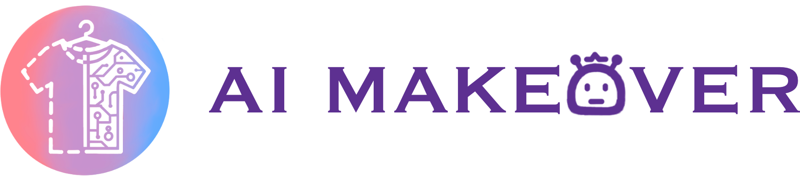

# AI Makeover

⚠️: This project is still under heavy development, and the codes and API are **NOT** consistent.

[Download prereleased apk](https://github.com/JesseSenior/aim/releases/download/v0.0.1/aim.apk)

For flutter app's source code, see [branch gui](https://github.com/JesseSenior/aim/tree/gui)

## Backend Installation

```bash
pip3 install torch torchvision torchaudio --index-url https://download.pytorch.org/whl/cu121

python -m pip install 'git+https://github.com/facebookresearch/detectron2.git'

# Manually install paddlepaddle-gpu by following this reference:
# https://www.paddlepaddle.org.cn/
python -m pip install paddlepaddle-gpu==2.6.1.post120 -f https://www.paddlepaddle.org.cn/whl/windows/mkl/avx/stable.html

# clone this project and run the following command
pip install -e .

python -m aim.scripts.prepare # Download weights for inference
```

If paddlepaddle not working correctly on windows, you may refer to this [issue](https://github.com/PaddlePaddle/PaddleOCR/issues/11230).
